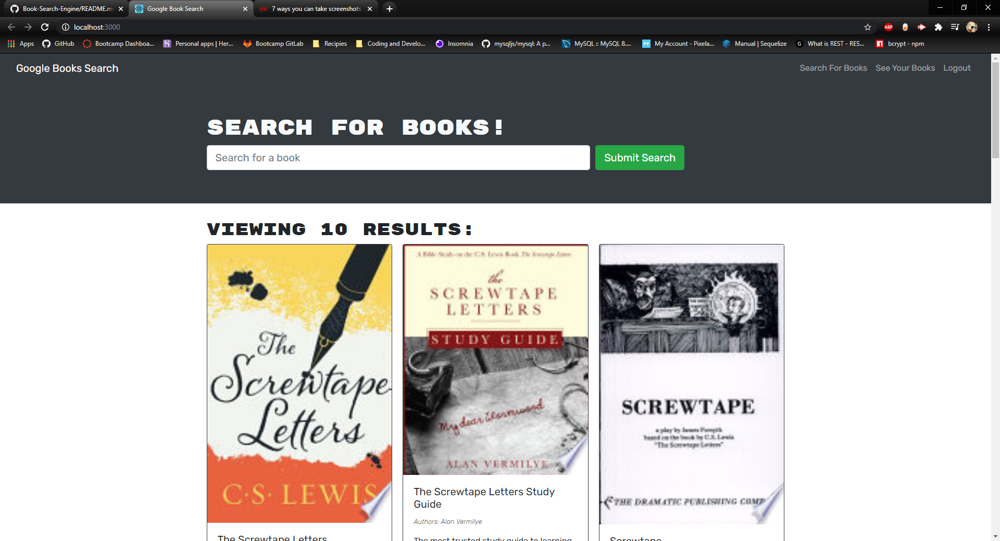
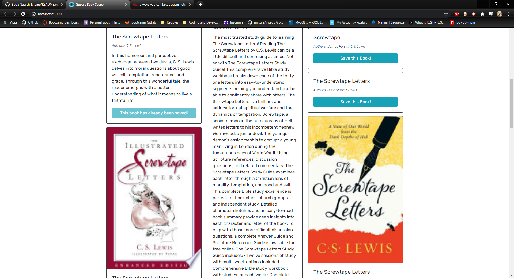
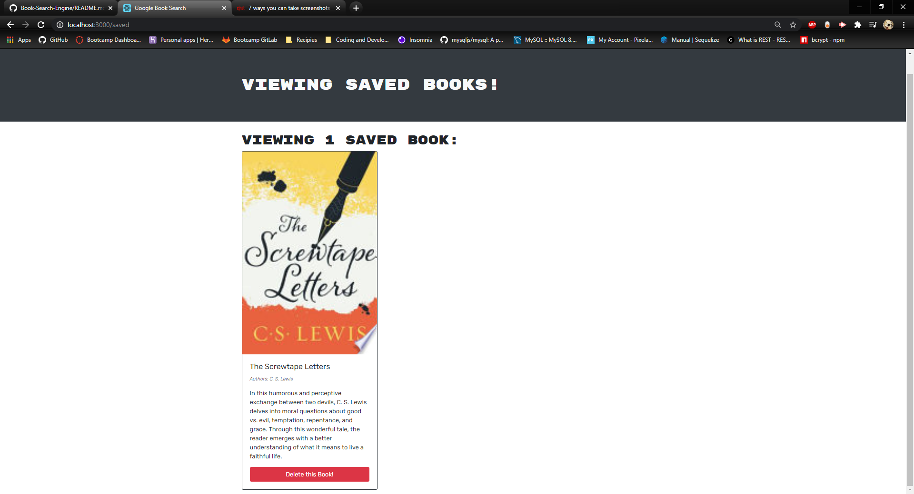

 # Book Search Engine
    

  ## Description
  

  This is a MERN application that allows you to develop a list of books that you can save to remember to either look up, or cross off your list without fear of forgetting which ones!

  ## Table of Contents
  * [Installation](#installation)
  * [Usage](#usage)
  * [License](#license)
  * [Contribution](#contribution)
  * [Tests](#tests)
  * [Contact](#contact)

  ## Installation
  First you need to clone the repo to your computer. Once you've done that, make sure that you open a terminal at the root folder of the application and run npm install to get all the dependancies. Once you've done that you can code away to your hearts content. npm start will start the server so you can see what the changes you make will do to the application. 

  ## Usage
  Once you've navigated to the site hosting the application, simply log in and start searching for books. Navigate to the Saved Books tab to see which books you've saved and remove any that you no longer need. There will be a button at the bottom of the cards that allow you to save and delete the books to and from your profile. 

  ## License
  This project uses the MIT license. Check out <a href="https://choosealicense.com">this</a> website for more information on this and other licenses. 

  ## Contribution
  This was originally developed using a RESTful API and was adapted into using GraphQL. The next best step would be to migrate it to use as a mobile application, that can be used with or without internet. 

  ## Tests
  
  
  

  
  ## Contact
  Learn more about the owner of this project by visiting their Github Profile: <a href=https://github.com/FullmerJake>FullmerJake</a>

  If you have any questions or concerns about this project, you can get a hold of the owner at w.jake.fullmer@gmail.com! Just send them an email and they will get back to you as soon as they can. 
